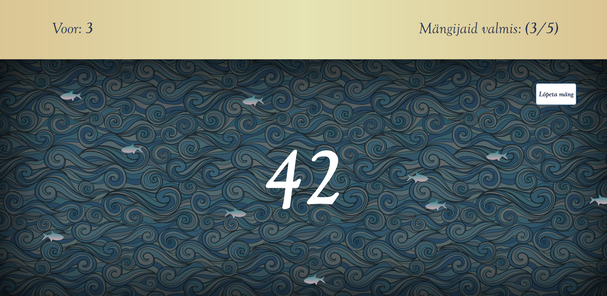

# HarvestProject

# Eesmärk
Eesmärgiks oli luua kalapüügiteemaline browseripõhine mäng, et klient ei peaks enam kasutama paberist lauamängu.
Klient loob oma arvutist mängu, millega õpilased oma sedamest liituda saavad. Nende eesmärgiks on püüda võimalikult palju kalu nii, et merest kalad otsa ei saaks.
Projekt sai loodud digitehnoloogiate instituudis tarkvaraarenduse praktika kursuse raames.
# Grupi liikmed
Teet Triisa, Kertu Mikk, Grete Ojavere, Kärt Nigols
# Kasutatud tehnoloogiad
1. PHP 5.6.31
2. MySQL 5.7.19
3. Javascript
4. CSS
5. HTML
# Installijuhend
1. Installi ja sätesta PHP, MySQL ja Apache server
2. Lae repositooriumi sisu apache jaoks sätestatud kausta
3. Kasutades faili database.sql impordi tabelid
    1.2. Käsureale kirjuta : mysql -u username -p database_name < database.sql;
4. Täita config fail configExample.php järgi
# Kasutusjuhend
1. Uue kasutaja registreerimine
    1.1. Kommenteeri sisse controller.php faili read 43-52 1.2. Reale 45 kirjuta ülakomade vahele soovitud kasutajanimi ja reale 46 sulgudesse ülakomade vahele soovitud salasõna
    1.3. Mine lehele ../controller.php?action=register
    1.4. Kommenteeri uuesti välja controller.php read 43-52
2. Mängu loomiseks mine lehele ../host.html
3. Mängu mängimiseks mine lehele ../index.html
# Litsents
https://github.com/TTriisa/HarvestProject/blob/master/LICENSE
